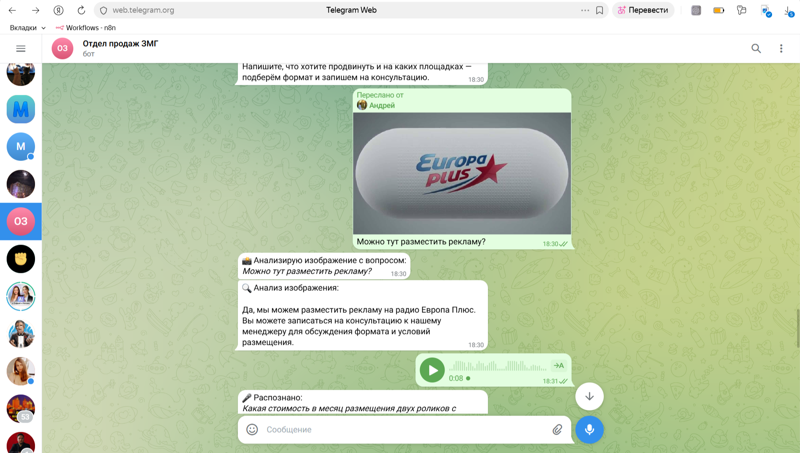

# Multimodal Telegram Assistant — RAG + Voice + Vision

Кейс: телеграм-ассистент для отдела продаж медиагруппы. Текст, голос, изображения, ответы по базе знаний с указанием источников.

---

## 1. 📌 Статус проекта

**Portfolio / MVP** — рабочий прототип с полным пайплайном (handlers → router → LLM/RAG/Vision/STT-TTS). Готов к демо и доработке под production (мониторинг, масштабирование, дообучение базы знаний).

---

## 2. 🎯 Бизнес-контекст

**Заказчик:** Забайкальская медиа группа (ЗМГ).

**Задача:** автоматизация первичного контакта с рекламодателями:
- квалификация запроса;
- консультация по форматам размещения (радио, портал ZAB.RU, ЗабТВ, соцсети);
- подведение к записи на консультацию с менеджером без раскрытия прайса в боте.

---

## 3. 🚀 Бизнес-результат

| Эффект | Описание |
|--------|----------|
| Снижение нагрузки на менеджеров | Первичные вопросы закрываются ботом (RAG + диалог). |
| Единая точка входа | Один канал для рекламодателей: текст, голос, картинки. |
| Масштабируемая консультация | Ответы по базе знаний без ручного копирования. |
| Стандартизация | Одинаковое качество ответов и единый тон коммуникации. |

---

## 4. 🧠 Архитектура

**Пайплайн:** `User → handlers → router → OpenAI (LLM / Vision / STT / TTS) + ChromaDB → ответ в Telegram`

| Слой | Назначение |
|------|------------|
| **handlers** | Приём сообщений (текст, голос, фото, документы), команды, вызов router. |
| **router** | Выбор режима (text / rag / voice / vision), сборка контекста, вызов LLM или RAG. |
| **rag** | Загрузка и чанкинг документов → индексация в ChromaDB → поиск по эмбеддингам → ответ с источниками. |
| **services** | openai_client, stt (Whisper), tts, vision, image_generation. |

**Режимы:** `/mode text | rag | voice | vision` — переключение без перезапуска.

---

## 5. 🧪 Пример диалога (User → Bot)

**User:** Хочу разместить рекламу на радио. Что по форматам и срокам?

**Bot:** ЗМГ предлагает размещение на радио в разных форматах: ролики в эфире, спонсорские блоки, интеграции в программы. Сроки и детали подбираются под задачу. Чтобы обсудить формат, бюджет и даты выхода — запишитесь на консультацию с менеджером. Напишите, пожалуйста, ваше имя, контактный телефон и удобное время для связи.

---

## 6. 📚 Пример RAG-ответа с источниками

**User:** Какие форматы размещения есть на портале ZAB.RU?

**Bot:** На портале ZAB.RU доступны баннеры на главной и в разделах, нативная интеграция в материалы и спецпроекты. Точные форматы и условия уточняйте у менеджера.

*Источник: форматы_zab_ru.pdf*

*(В реальном ответе источник подставляется из метаданных чанка в ChromaDB.)*

---

## 7. 📸 Скриншоты

<!-- Добавьте сюда скриншоты: главный экран бота, смена режима /mode, пример RAG-ответа с источником, голосовое сообщение, анализ изображения. -->

| Описание | Файл |
|----------|------|
| Стартовое меню, выбор режима | docs/screenshots |
| Диалог в режиме text/rag | docs/screenshots |
| RAG-ответ с указанием источника | docs/screenshots |
| Голосовой ввод / ответ | docs/screenshots |
| Анализ изображения (vision) | |

---

## 8. 💼 Что демонстрирует проект

| Навык / технология | Реализация в проекте |
|--------------------|------------------------|
| **RAG** | Загрузка PDF/TXT/MD → чанкинг → ChromaDB + OpenAI Embeddings → поиск по запросу → ответ только по контексту с указанием источника. |
| **Мультимодальность** | Текст (LLM), голос (Whisper STT + TTS), изображения (Vision API), документы (загрузка в базу знаний). |
| **Роутинг** | Единый router: определение режима, история диалога, вызов нужного сервиса (LLM / RAG / vision / STT-TTS). |
| **Embeddings + векторный поиск** | Индексация чанков в ChromaDB, similarity search, подстановка контекста в промпт. |
| **Продуктовый контекст** | Ограничение ответов базой знаний, отказ от обсуждения цен в боте, перевод в воронку (запись к менеджеру). |

---

## Технологии

Python · pyTelegramBotAPI (AsyncTeleBot) · OpenAI API (GPT-4o, Whisper, TTS, Vision) · LangChain · ChromaDB · OpenAI Embeddings

---

## Запуск

```bash
python -m venv venv
venv\Scripts\activate   # Windows
pip install -r requirements.txt
```

Создать `.env`: `TELEGRAM_BOT_TOKEN=`, `OPENAI_API_KEY=`

```bash
python main.py
```

Документы для RAG — в `data/documents/` (PDF, TXT, MD). Статистика базы: `/stats`.
